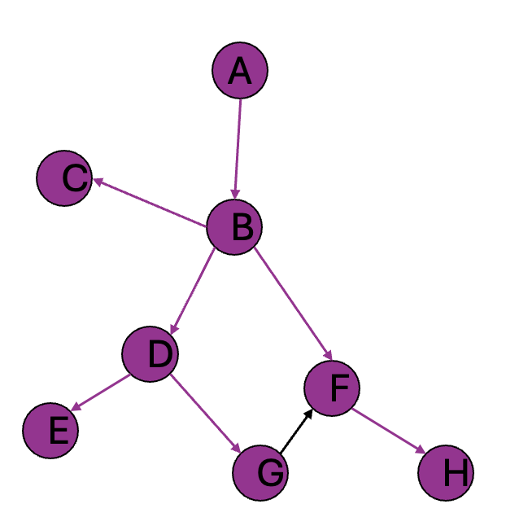

# BMI203 Assignment 2
Breadth-first search

# Breadth-first search
Breadth-First Search (BFS) is a fundamental graph traversal algorithm used to explore and navigate through graphs or trees. It begins at a specified starting node and systematically explores all its neighbors before moving on to the next level of neighbors. This approach ensures that nodes are visited in the order of their distance (in terms of edges) from the starting node.

## Key Characteristics:
* Traversal Order: BFS explores all nodes at the current depth level before moving to the next level.
* Queue-Based: It uses a queue data structure to manage nodes that are yet to be visited.
* Shortest Path: In an unweighted graph, BFS guarantees the shortest path between the starting node and any other reachable node.

## Steps of BFS:
* Initialize a queue and add the starting node to it.
* Mark the starting node as visited.
* While the queue is not empty:
* Dequeue a node.
* Process the node (e.g., add it to the traversal order or check for a target node).
* Enqueue all unvisited neighbors of the node and mark them as visited.

# Methods Description

  

The bfs (Breadth-First Search) method in this project is based on the pseudocode provided in the Lecture Slides (Slides #24–38).
These slides outline the core concepts and implementation flow of the BFS algorithm. Additionally, inspiration was drawn from a classic BFS post written in C++ available on GeeksforGeeks: Breadth-First Search or BFS for a Graph.

## Key elements of the implementation include:

* A queue data structure (deque) to efficiently manage nodes to be explored, as per the BFS principle.
* A visited set to ensure each node is processed only once, preventing redundant operations.
* A history dictionary to trace the parent nodes for reconstructing the shortest path when a target node (end) is provided.

## The design of the method considers edge cases such as:

* Performing BFS on an empty graph.
* Handling graphs with disconnected components.
* Dealing with invalid or non-existent start and end nodes.
* This hybrid approach ensures a robust and Pythonic implementation of BFS, combining theoretical foundations with practical insights from established examples.

# Reference Information
## Test Data
Two networks have been provided in an adjacency list format readable by [networkx](https://networkx.org/), is a commonly used python package for working with graph structures. These networks consist of two types of nodes:
* Faculty nodes
* Pubmed ID nodes

However, since these are both stored as strings, you can treat them as equivalent nodes when traversing the graph. The first graph ("citation_network.adjlist") has nodes consisting of all BMI faculty members, the top 100 Pubmed papers *cited by* faculty, and the top 100 papers that *cite* faculty publications. Edges are directed and and edge from node A -> B indicates that node A *is cited by* node B. There are 5120 nodes and 9247 edges in this network.

The second network is a subgraph of the first, consisting of only the nodes and edges along the paths between a small subset of faculty. There are 30 nodes and 64 edges.
